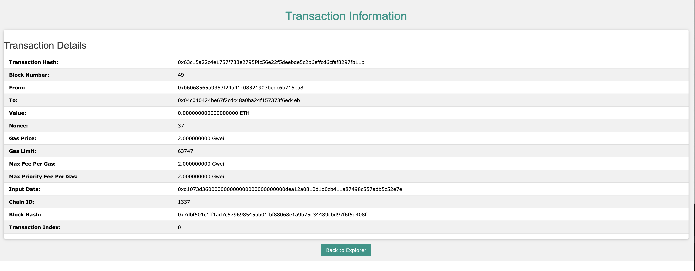

# Blockchain Explorer

I was looking for a basic and simple to implement blockchain explorer using the RPC API preferrably in PHP, but only found out-dated convoluted examples. So I asked chatgpt.com the following,

```
create a blockchain explorer like etherscan.io in PHP that 
interacts with the RPC blockchain API
```

then added additional customizations to deliver the simple PHP implementation similar to the[ etherscan.io.](https://etherscan.io)


TPS values is calculated when there are at least 100 blocks.





If you see the message "**VM Exception while processing transaction,**" the smart contract was compiled with a different version of solidity.


When the redirects are properly configured, the token information can be view from metamask links,


A much needed component for the blockchain explorer is direct interaction with the smart contracts. Previously, would be achieved by connecting REMIX to the localhost blockchain like GANACHE,  use REMIX is directory access mode or import local controcts to the REMIX IDE, select the contract, enter the contract address on the local blockchain in the REMIX deploy IDE and connect REMIX to the already deployed contract.

Now just select the token, load the ABI json file (works with both REMIX and TRUFFLE generate ABI json) and generate the form.


Next steps is to integrate the blockchain explorer and contract user interface in the [Ethereum Contract Creator](https://snapcraft.io/ethereum-contract-creator) application.

# EIP-3091: Block Explorer API Routes

See [https://eips.ethereum.org/EIPS/eip-3091](https://eips.ethereum.org/EIPS/eip-3091)

To make this blockchain explorer compliant with EIP-3091 involves  creating redirect rules in .htaccess, (in htaccess_production), rename to .htaccess

```
RewriteEngine On
RewriteRule ^block/(.*)$ /blocks.php?block=$1 [L,R=301]
RewriteRule ^tx/(.*)$ /transaction.php?tx=$1 [L,R=301]
RewriteRule ^address/(.*)$ /account.php?address=$1 [L,R=301]
RewriteRule ^token/(.*)$ /token.php?address=$1 [L,R=301]

```

to view a token directly (especially invoke from metamask), uses the URL of

```
https://[EXPLORER_URL]/token/0x2894227C135C696Ce21700f120d2C3261beD86Ae
```

Steps to obtain the list of ERC-20 tokens. There is no direct ETH RPC request but is accomplished through a series of request,

1. Get the logs a specific token events, e.g. "topics" => ["0xddf252ad1be2c89b69c2b068fc378daa952ba7f163c4a11628f55a4df523b3ef"]
2. The contract address is in the address field of the response.
3. Read the contract address from the result['address'] array and invoke eth_call for retrieving the name, symbol, decimals and totalSupply, skip any response with an error.

The Keccak-256 hash is used in Ethereum for various purposes, such as function signatures in smart contracts. To compute the Keccak-256 hash for the functions `name()`, `symbol()`, `decimals()`, and `totalSupply()`, you need to hash their signatures.

### eth_getLogs

example request,

```
{
    "jsonrpc":"2.0",
    "method":"eth_getLogs",
    "params":[
        {
            "fromBlock": "0x0",          // Start block
            "toBlock": "latest",        // End block
            "topics": [
                "0xddf252ad1be2c89b69c2b068fc378daa952ba7f163c4a11628f55a4df523b3ef"
        ]
        }
    ],
    "id":"{{rpcid}}"
}
```

response,

```
{
    "id": "19345f34f67",
    "jsonrpc": "2.0",
    "result": [
        {
            "address": "0xcbcbcbff300490b36ad7ee3e4c1c96d746fb9294",
            "blockHash": "0x66b6784776ae93ec276d725aaea535c5df02d9016cb24b2d98381102d0b4e755",
            "blockNumber": "0xd",
            "data": "0x00000000000000000000000000000000000000000000152d02c7e14af6800000",
            "logIndex": "0x0",
            "removed": false,
            "topics": [
                "0xddf252ad1be2c89b69c2b068fc378daa952ba7f163c4a11628f55a4df523b3ef",
                "0x0000000000000000000000000000000000000000000000000000000000000000",
                "0x000000000000000000000000b6068565a9353f24a41c08321903bedc6b715ea8"
            ],
            "transactionHash": "0x882da3c9b1e54507166959581d7ee73921887ed4dfe70d54e45ede5d65c6addd",
            "transactionIndex": "0x0"
        },
        {
            "address": "0x2894227c135c696ce21700f120d2c3261bed86ae",
            "blockHash": "0xa518b5939999efb35ee84c44d12dbc6ea6d6cdd3538372301c1a04c0eaeac5dc",
            "blockNumber": "0xe",
            "data": "0x00000000000000000000000000000000000000000000152d02c7e14af6800000",
            "logIndex": "0x0",
            "removed": false,
            "topics": [
                "0xddf252ad1be2c89b69c2b068fc378daa952ba7f163c4a11628f55a4df523b3ef",
                "0x0000000000000000000000000000000000000000000000000000000000000000",
                "0x000000000000000000000000b6068565a9353f24a41c08321903bedc6b715ea8"
            ],
            "transactionHash": "0xae4501d65571e002c815f23e4ffcab018296d97f5c263ba2f8be4df890902c1c",
            "transactionIndex": "0x0"
        },
        {
            "address": "0x3f2fecd4b38b34229fafc85249c8034daf00b51a",
            "blockHash": "0x2209188710a399ff769b5dba66b20a6e4110103d80e2e4c11774bc50ddca2fba",
            "blockNumber": "0x18",
            "data": "0x0000000000000000000000000000000000000000000000000000000000030d40",
            "logIndex": "0x0",
            "removed": false,
            "topics": [
                "0xddf252ad1be2c89b69c2b068fc378daa952ba7f163c4a11628f55a4df523b3ef",
                "0x0000000000000000000000000000000000000000000000000000000000000000",
                "0x000000000000000000000000b6068565a9353f24a41c08321903bedc6b715ea8"
            ],
            "transactionHash": "0xc38b1dbb432ec928da8a9dbd32931a0cdb46a2408bf80d1367529852267082d3",
            "transactionIndex": "0x0"
        }
    ]
}
```

### Complete Table

| Function                | Signature         | Function Selector (4 bytes) |
| ----------------------- | ----------------- | --------------------------- |
| **name()**        | `name()`        | `0x06fdde03`              |
| **symbol()**      | `symbol()`      | `0x95d89b41`              |
| **decimals()**    | `decimals()`    | `0x313ce567`              |
| **totalSupply()** | `totalSupply()` | `0x18160ddd`              |

## ChatGPT Initial Response

Creating a blockchain explorer in PHP that interacts with an RPC blockchain API is a powerful project! Here’s an outline of the major components and a guide to get you started with basic functionality.

### Requirements

1. **PHP**: To handle server-side operations.
2. **Blockchain RPC API**: Your blockchain must support JSON-RPC or REST API calls.
3. **Database**: MySQL or PostgreSQL for storing data (e.g., transactions, blocks).
4. **JavaScript**: Optional but useful for dynamic updates on the front end.

### Basic Structure

A blockchain explorer typically includes:

1. **Block Information**: Displaying details about each block.
2. **Transaction Details**: Showing transaction data, including sender, receiver, amount, and fees.
3. **Account Information**: Viewing account balances and recent transactions.
4. **Search Functionality**: Finding specific blocks, transactions, or accounts.

---

### Step 1: Set Up the PHP Project

1. **Install PHP** and necessary extensions (`curl`, `json`, `pdo_mysql`, etc.).
2. Create a new project directory (e.g., `blockchain-explorer`).

```bash
mkdir blockchain-explorer
cd blockchain-explorer
```

3. Create your project files:

   - `index.php`: Main entry point for the web interface.
   - `config.php`: Configuration file for your API connection and database.
   - `rpc_client.php`: PHP file to handle JSON-RPC requests.
   - `blocks.php`: Page to display block information.
   - `transaction.php`: Page to display transaction details.
   - `account.php`: Page for account information.

---

### Step 2: Configure Blockchain RPC Connection

In `config.php`, add your connection information to the blockchain node.

```php
<?php
// RPC API credentials
define('RPC_URL', 'http://127.0.0.1:8545'); // Replace with your blockchain node's URL
define('RPC_USER', ''); // Set if required
define('RPC_PASSWORD', ''); // Set if required
?>
```

---

### Step 3: Create the RPC Client

The `rpc_client.php` file will handle JSON-RPC requests to the blockchain node.

```php
<?php
require_once 'config.php';

function rpcRequest($method, $params = []) {
    $payload = json_encode([
        'jsonrpc' => '2.0',
        'method'  => $method,
        'params'  => $params,
        'id'      => 1
    ]);

    $ch = curl_init(RPC_URL);
    curl_setopt($ch, CURLOPT_RETURNTRANSFER, true);
    curl_setopt($ch, CURLOPT_HTTPHEADER, ['Content-Type: application/json']);
    curl_setopt($ch, CURLOPT_POST, true);
    curl_setopt($ch, CURLOPT_POSTFIELDS, $payload);

    if (RPC_USER && RPC_PASSWORD) {
        curl_setopt($ch, CURLOPT_USERPWD, RPC_USER . ":" . RPC_PASSWORD);
    }

    $response = curl_exec($ch);
    if (curl_errno($ch)) {
        echo 'Error:' . curl_error($ch);
    }
    curl_close($ch);

    return json_decode($response, true);
}
?>
```

---

### Step 4: Build the User Interface Pages

#### 1. Block Information (`blocks.php`)

This page will list blocks and allow you to view details of a specific block.

```php
<?php
require_once 'rpc_client.php';

if (isset($_GET['block'])) {
    $blockHash = $_GET['block'];
    $block = rpcRequest('eth_getBlockByHash', [$blockHash, true]);
} else {
    $blockNumber = rpcRequest('eth_blockNumber', []);
    $blockNumber = hexdec($blockNumber['result']);
    $block = rpcRequest('eth_getBlockByNumber', ['0x' . dechex($blockNumber), true]);
}

echo "<h2>Block Information</h2>";
echo "<pre>" . print_r($block, true) . "</pre>";
?>
```

#### 2. Transaction Details (`transaction.php`)

This page will show details for a specific transaction.

```php
<?php
require_once 'rpc_client.php';

if (isset($_GET['tx'])) {
    $txHash = $_GET['tx'];
    $transaction = rpcRequest('eth_getTransactionByHash', [$txHash]);

    echo "<h2>Transaction Information</h2>";
    echo "<pre>" . print_r($transaction, true) . "</pre>";
} else {
    echo "Transaction hash is required.";
}
?>
```

#### 3. Account Information (`account.php`)

This page will show information for a specific account, including its balance and recent transactions.

```php
<?php
require_once 'rpc_client.php';

if (isset($_GET['address'])) {
    $address = $_GET['address'];
    $balance = rpcRequest('eth_getBalance', [$address, 'latest']);

    echo "<h2>Account Information</h2>";
    echo "Address: $address<br>";
    echo "Balance: " . hexdec($balance['result']) . "<br>";

    // Optional: list recent transactions by scanning recent blocks
} else {
    echo "Address is required.";
}
?>
```

---

### Step 5: Add Search Functionality

Create a simple form on `index.php` that lets users search by block hash, transaction hash, or address.

```php
<!DOCTYPE html>
<html>
<head>
    <title>Blockchain Explorer</title>
</head>
<body>
    <h1>Blockchain Explorer</h1>
    <form action="search.php" method="GET">
        <input type="text" name="query" placeholder="Block, Transaction, or Address">
        <button type="submit">Search</button>
    </form>
</body>
</html>
```

In `search.php`, detect the type of query based on the format (block hashes, transaction hashes, and addresses have distinct lengths and characters) and redirect to the appropriate page.

```php
<?php
$query = $_GET['query'];

// Detect type
if (preg_match('/^0x[0-9a-fA-F]{64}$/', $query)) {
    // Likely a transaction hash
    header("Location: transaction.php?tx=$query");
} elseif (preg_match('/^0x[0-9a-fA-F]{40}$/', $query)) {
    // Likely an address
    header("Location: account.php?address=$query");
} else {
    // Default to assuming it's a block hash
    header("Location: blocks.php?block=$query");
}
exit();
?>
```

---

### Step 6: Optional Enhancements

- **Database Caching**: Store frequent data to reduce load on the RPC API.
- **Pagination**: Add pagination to blocks and transactions.
- **Real-time Updates**: Use JavaScript and WebSockets to dynamically update recent transactions and blocks.

This setup will give you a basic blockchain explorer structure in PHP! With further improvements, such as enhanced styling, real-time updates, and caching, you can make it more robust and user-friendly.

## Testing

Testing perform using php-cli,

```
php -S 127.0.0.1:8080 -t ./
```

## Domain Registration

Scanning porkbun.com for the "renews at $4." found the .top TLD as the lowest priced TLD, the other domains at .in (India country specific)

### About the TOP domain

Why choose a .top domain?

#### .top overview

Show your audience that your products are the best with a customized .top domain name. If you’re on top, you’re way beyond the competition. This TLD stands out from the crowd, and it tells your website visitors that your business does too. The possibilities with .top are endless. What’s undeniable is that this short, memorable TLD comes with plenty of positive associations.

#### .top facts, stats & history

Available to the public since 2014, .top is a newer, generic top-level domain (TLD). That means that anyone in the world can register a .top domain name, and you have a much better chance of getting the exact name you want. Plus, unique TLDs like .top can help you stand out. How better to get your visitors’ attention than saying you’re above the rest before they even visit your site?

### Hosting

Once you have registered your TLD, you want to choose a hosting provider that will provide two sub-domain options, because your want to have a blockchain explorer for TEST and LIVE blockchain

## Adding to chainid.network

Visit [https://github.com/ethereum-lists/chains](https://github.com/ethereum-lists/chains)

## Live Example of a Test Network

Visit [https://test-explorer.exemptliquiditymarket.exchange/](https://test-explorer.exemptliquiditymarket.exchange/)
